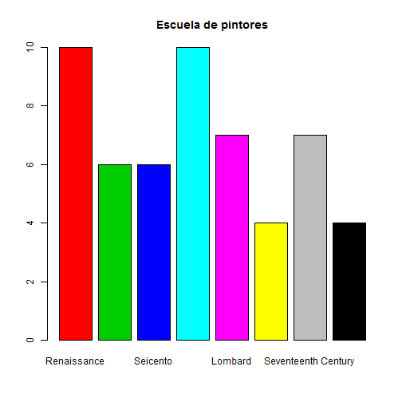

# Diagrama de barras

Esta representación gráfica consiste en construir tantos rectángulos como modalidades presente el carácter cualitativo en estudio, todos ellos con base de igual amplitud. La altura se toma igual a la frecuencia absoluta o relativa, consiguiendo de esta manera rectángulos con áreas proporcionales a las frecuencias que se quieren representar.

__Ejemplo__

En el conjunto de datos [painters](#painters), el diagrama de barras de la variable _School_ es una colección de rectángulos verticales que muestran el número de pintores en cada escuela.

__Problema__

Encuentra el diagrama de barras de las escuelas de pintura en el data frame _painters_.

__Solución__

Primeros encontraremos la [distribución de frecuencias absolutas](#fqualitative) de la variable _School_.


```r
> library(MASS)
> school = painters$School
> school.freq = table(school)
```

Entonces aplicamos la función _barplot()_ para producir el diagrama.

```
barplot(school.freq)

```

__Respuesta__

El diagrama de barras de la variable _School_ es:


Una solución mejorada sería:


```r
> ##Creamos un vector con colores para cada rectángulo
> colors <- c(2, 3, 4, 5, 6, 7, 8, 9)
> ##Creamos un vector con los nombres de las escuelas
> names <- c("Renaissance", "Mannerist", "Seicento", "Venetian", 
+            "Lombard", "Sixteenth Century", "Seventeenth Century", 
+            "French")
> barplot(height = school.freq, names.arg = names, col = colors, main = "Escuela de pintores")
```




