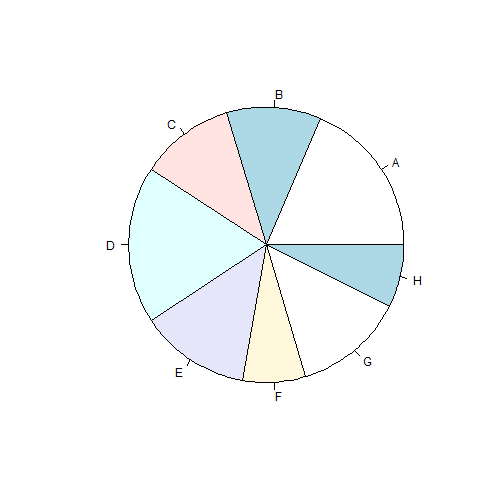

# Diagrama de sectores

La representación gráfica de un __diagrama de sectores__ consiste en dividir un círculo en tantos sectores circulares como modalidades presente el carácter cualitativo asignando un ángulo central a cada sector circular proporcional a la frecuencia absoluta $$n_{i}$$ consiguiendo de esta manera un sector con área proporcional también a $$n_{i}$$.

__Ejemplo__

En el conjunto de datos [painters](https://rsanchezs.gitbooks.io/statsr/content/chapter1/index.html), el diagrama de sectores de la variable _School_ es una colección de "porciones de pizza"" mostrando los pintores de cada escuela.

__Problema__

Encontrar el diagrama de sectores de las escuelas de pintura en el data frame _painters_.


__Solución__

En primer lugar encontramos la distribución de frecuencias de la variable _School_:


```r
> library(MASS)   #cargamos la líbreria
> school <- painters$School
> school.freq = table(school)
> school.freq
```

```
school
 A  B  C  D  E  F  G  H 
10  6  6 10  7  4  7  4 
```
Por último, producimos el diagrama con la funcion _pie()_:

```
pie(school.freq)

```
__Respuesta__

El diagrama de sectores de la variable _School_ es:



Una solución mejorada podría ser la siguiente:


```r
> ##Creamos un vector con colores para cada rectángulo
> colors <- c(2, 3, 4, 5, 6, 7, 8, 9)
> ##Creamos un vector con los nombres de las escuelas
> names <- c("Renaissance", "Mannerist", "Seicento", "Venetian", 
+            "Lombard", "Sixteenth Century", "Seventeenth Century", 
+            "French")
> pie(x = school.freq, labels = names, col = colors, main = "Escuelas de pintura")
```


