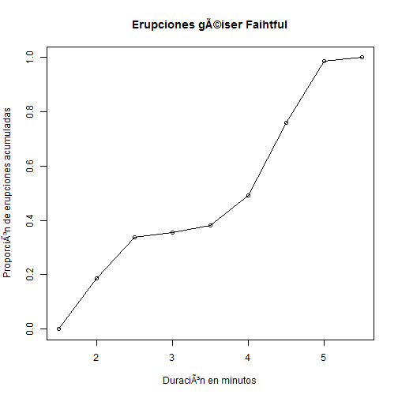

# Polígono de frecuencias relativas acumuladas

Un __polígono de frecuencias relativas acumuladas_ de una variable cuantitativa es una representación gráfica de una curva representadndo la distribución.

__Ejemplo__

En el conjunto de datos [faithful](README.md), un punto en el polígono de frecuencias relativas acumuladas de la variable _eruption_ representa la proporción de frecuencias de las erupciones cuyas duraciones son menores que o igual a un nivel dado.

__Problema__

Encontrar el polígono de frecuencias relativas acumuladas de la variable _eruption_ en  el data frame _faithful_.

__Solución__

En primer lugar encontraremos la [distribución de frecuencias relativas acumuladas](fcumulative.md).


```r
duration <- faithful$eruptions
breaks <- seq(1.5, 5.5, by=0.5)
duration.cut <- cut(duration,  breaks, by=0.5, right = FALSE)
duration.freq <- table(duration.cut)
duration.cumfreq = cumsum(duration.freq)
duration.cumrelfreq = duration.cumfreq / nrow(faithful)
```

A continuación graficamos el polígono con el cero como primer elemento.

```
cumrelfreq <- c(0, duration.cumrelfreq)
plot(breaks, cumrelfreq,
     main = "Erupciones géiser Faihtful",
     xlab = "Duración en minutos",
     ylab = "Proporción de erupciones acumuladas")
lines(breaks, cumrelfreq)


```

__Respuesta__

El polígono de distribución de frecuencias relativas acumuladas es:




