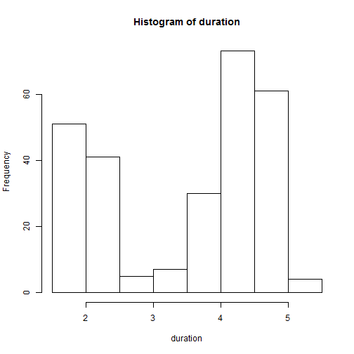
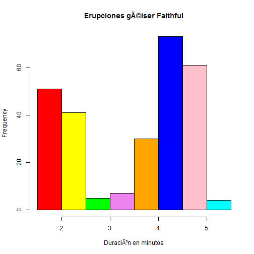

# Histograma

La representación grafica __Histograma__ consiste de rectángulos paralelos con un área igual a la frecuencia, absoluta o relativa según la distribución que estemos considerando, y una base igual a la amplitud de los intervalos. 

__Ejemplo__

En el conjunto de datos [faithful](./README.md), el histograma de la varible __eruption__ es una colección de rectángulos paralelos que muestran el número de erupciones clasificads de acuerdo a sus duraciones.

__Problema__

Encontrar el histograma de la variable _eruption_ en el data frame _faithful_.

__Solución__

Utilizaremos la función ___hist()___ para producir el histograma de la variable erupciones.

```
duration <- faithful$eruptions
hist(duration, right = FALSE)

```

__Respuesta__

El histograma de las erupciones es:


```r
duration <- faithful$eruptions
hist(duration, right = FALSE)
```




__Solución mejorada__


```r
colors = c("red", "yellow", "green", "violet", "orange", "blue",
           "pink", "cyan")

hist(duration, right = FALSE,
     col = colors,
     main="Erupciones géiser Faithful",
     xlab = "Duración en minutos")
```



