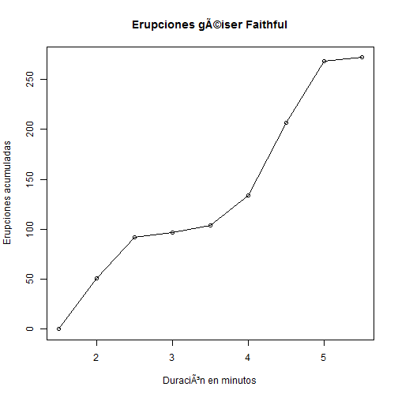

# Polígono de frecuencias  acumuladas

Un __polígon de frecuencias absolutas acumuladas__ de un dato cuantitativo és una curva que representa la distribución de frecuencias absolutas acumuladas.

__Ejemplo__

En el conjunto de datos [faithful](README.md), un punto en el polígono de frecuencias acumuladas de la variable _eruption_ representa el número _total_ de erupciones cuyas duraciones son menor que o igual a un rango dado.

__Problema__

Encontrar el polígono de frecuencias acumuladas en _faithful_.

__Solución__

En primer lugar tenemos que encontrar la [distribucioón de frecuencias absolutas](./nquantitative.md).


```r
duration <- faithful$eruptions
breaks <- seq(1.5, 5.5, by=0.5)
duration.cut <- cut(duration, breaks, right = FALSE)
duration.freq <- table(duration.cut)
```
Entonces podemos utilitzar la función __cumsum()__ para computar la distribución de frecuencias absolutas acumuladas.


```r
duration.cumfreq <- c(0,cumsum(duration.freq))
```

Obsérvese en el paso anterior que hemos computado la distribución de frecuencias acumuladas creando un vector que contiene como primer elemento el 0.

A continuación vamos a graficar el polígono:


```r
plot(breaks, duration.cumfreq,
     main="Erupciones géiser Faithful",
     xlab = "Duración en minutos",
     ylab = "Erupciones acumuladas")
lines(breaks, duration.cumfreq)
```



