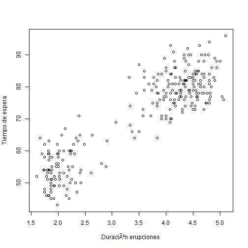

# Diagrama de dispersión y recta de mínimos cuadrados

La representación gráfica, denominada __diagrama de dispersión__ o _nube de puntos_, se hace utilizando un sistema de ejes de coordenadas de dos dimensiones representando cada dato $$(x_{i}, y_{j})$$ en un punto de coordenadas $$(x_{i}, y_{j})$$.

# Ejemplo

En el conjunto de datos [faithful](../chapter2/nquantitative.md), emparejamos el par de valores de _eruption_ y _duration_ en la misma observación como coordenadas (x, y). Entonces representaremos los puntos en el plano Cartesiano.


```r
library(MASS)
duration <- faithful$eruptions
waiting <- faithful$waiting
head(cbind(duration, waiting))
```

```
##      duration waiting
## [1,]    3.600      79
## [2,]    1.800      54
## [3,]    3.333      74
## [4,]    2.283      62
## [5,]    4.533      85
## [6,]    2.883      55
```

# Problema

Encuentra el diagrama de dispersión de la distribución bidimensional de frecuencias de las variables _eruption_ y _waiting_. Determinar la recta de mínimos cuadrados.

# Solución

Aplicaremos la función __plot()__ para computar el diagrama de dispersión de _eruption_ y _waiting_.

```
duration <- faithful$eruptions
waiting <- faithful$waiting
plot(x = duration, y = waiting,
     xlab = "Duración erupciones",
     ylab = "Tiempo de espera")

```

# Respuesta



A continuación para encontrar la recta de mínimos cuadradaos para generar un modelo de regresión lineal de las dos variables podemos utilizar la función __lm()__ y posterioremente añadirlo al diagrama de dispersión mediante la función __abline()__.


```r
abline(lm(waiting ~ duration))
```

```
## Error in int_abline(a = a, b = b, h = h, v = v, untf = untf, ...): plot.new has not been called yet
```


