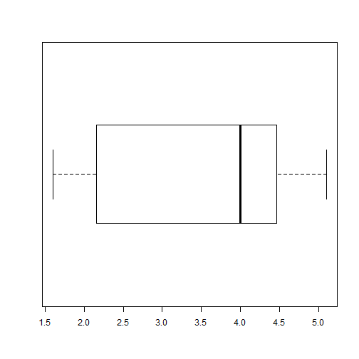

# Diagrama de cajas

El __diagrama de cajas__ de las observaciones de una variable es una representación gráfica basada en sus cuartiles, valor máximo y mínimo.

__Problema__

Encuentra el diagrama de cajas de la variable _eruption_ en el conjunto de datos [faithful](../chapter2/README.md).

__Solución__

Aplicaremos la función __boxplot()__ para producir el diagrama de cajas de la variable _eruption_.

```
duration <- faithful$eruptions
boxplot(duration, horizontal = TRUE)

```

__Respuesta__

El diagrama de cajas de la duración en las erupciones es:


